# 🔰 Gestion-Taches
A task management system designed for efficient organization and execution of tasks, built with PHP and MySQL.

## 🌟 User Features

- Features
- Task creation, modification, and deletion.
- User-friendly interface for managing tasks.
- Organized storage of configuration files and dependencies.
- Test-driven development with PHPUnit.

## 🛠️ Technologies Used

- **Frontend:** HTML5, CSS3, JavaScript
- **Backend:** PHP , fpdf (php)
- **Database:** MySQL
- **Additional:** PDO (PHP Data Objects) for database operations

## 📋 Prerequisites

- PHP >= 8.1
- MySQL >= 5.7
- Web server (XAMPP/Nginx)
- Web browser

## ⚙️ Installation

1. Clone the repository

- git clone https://github.com/Chouchouachraf/Gestion-taches.git

2. Import the database

- Create a new database named `personnel_tasks`
- Import the `personnel_tasks.sql` file from the project root

3. Configure database connection

- Open the config/database.php file in your editor.
- Update the database credentials (host, username, password, and database name) to match your environment.

4. Install FPDF Library

- The fpdf directory in this project contains the FPDF library for generating PDFs.
If the fpdf folder is missing or the library needs to be updated:

   a- Visit the official FPDF website and download the library:  [official FPDF website](http://www.fpdf.org/).
   Extract the downloaded files.
   b- Rename the extracted folder to fpdf.
   c- Place the renamed fpdf folder into the project’s root directory (as shown in the file structure).
5. Install Dependencies

- Run Composer to install all the required dependencies, including PHPUnit for testing:
   composer install
  
6. Start your web server

## 📱 Screenshots
$ LOG IN
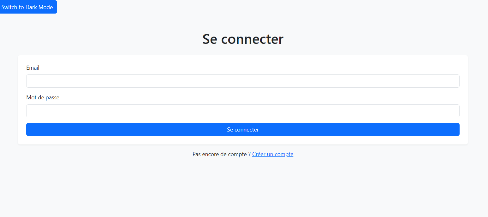
$ CREATE ACCOUNT
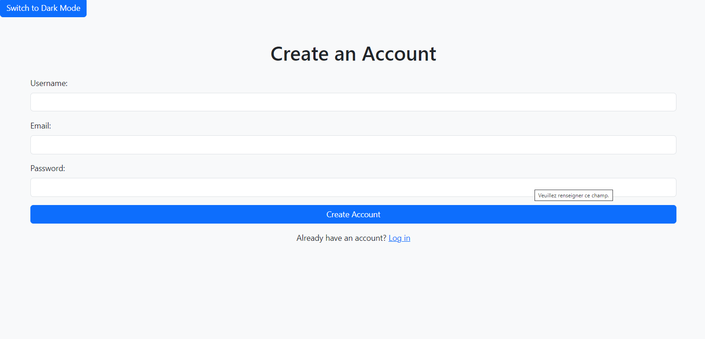
$ HOME PAGE
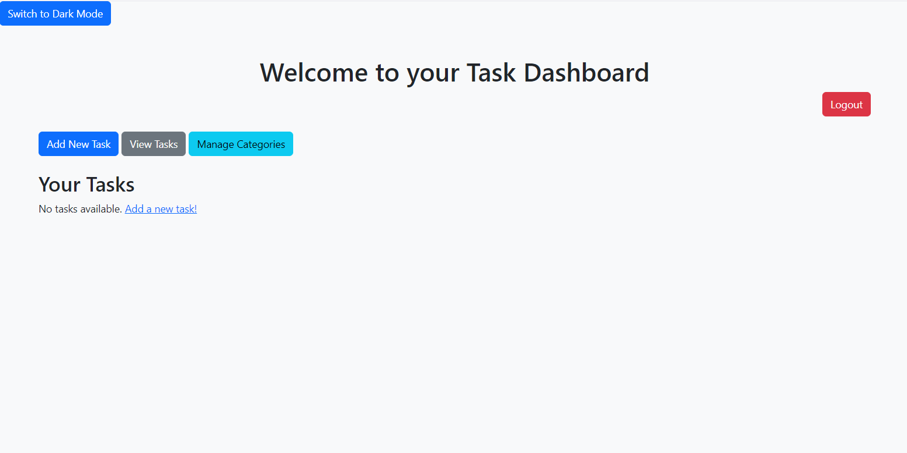
$ CREATE NEW TASK
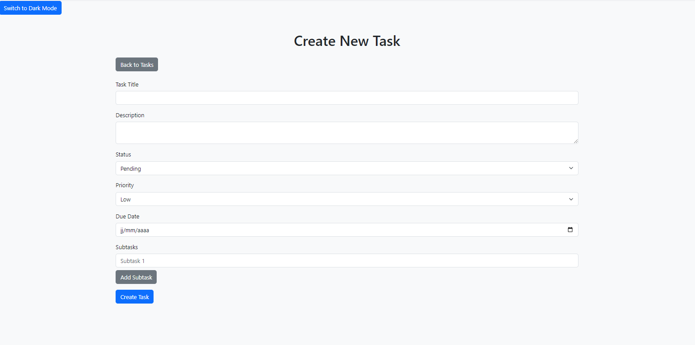
$ TASKS PAGE: FILTER BY...
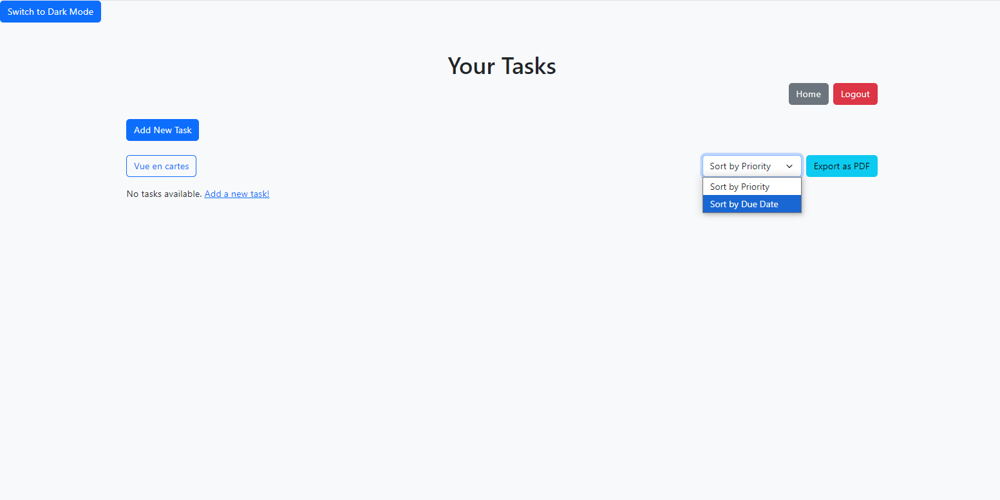
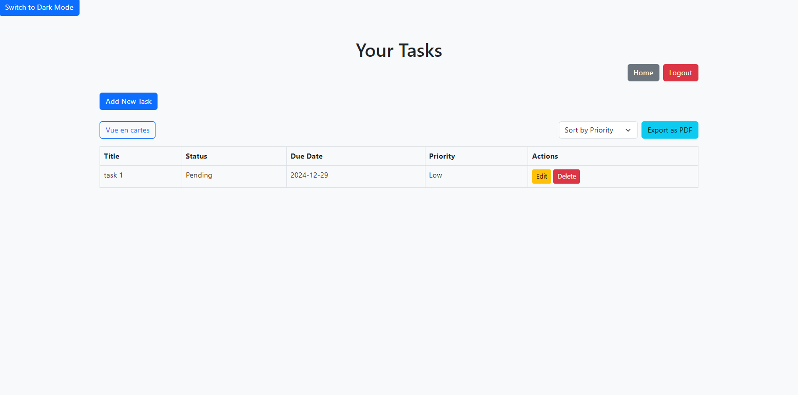
$ TASKS PAGE : VIEW TYPE
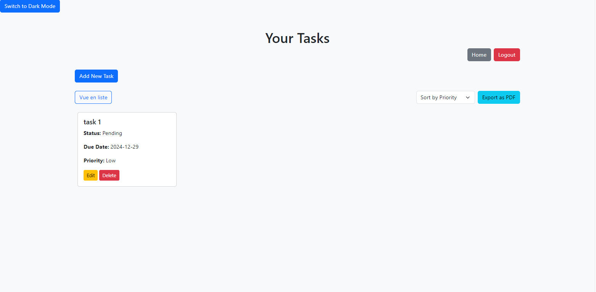
$ EXPORT TASK AS PDF
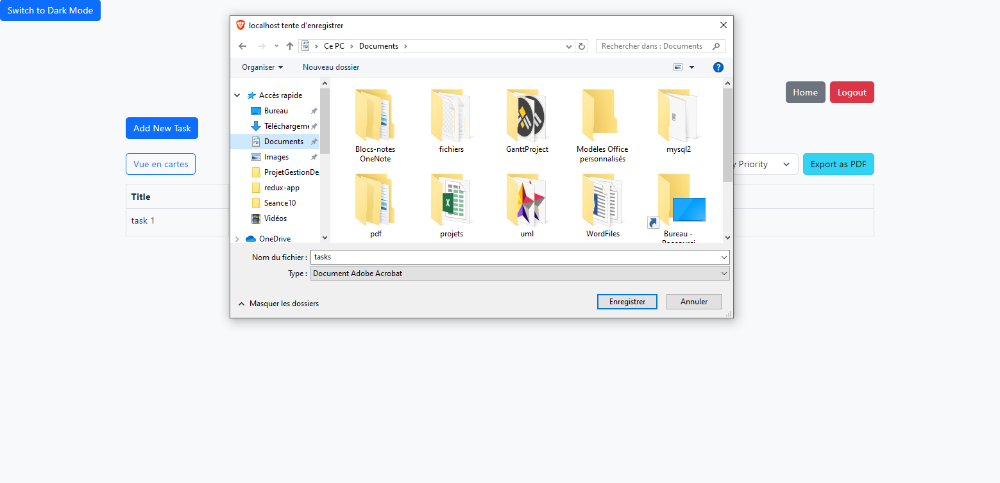
$ UPDATE TASK :
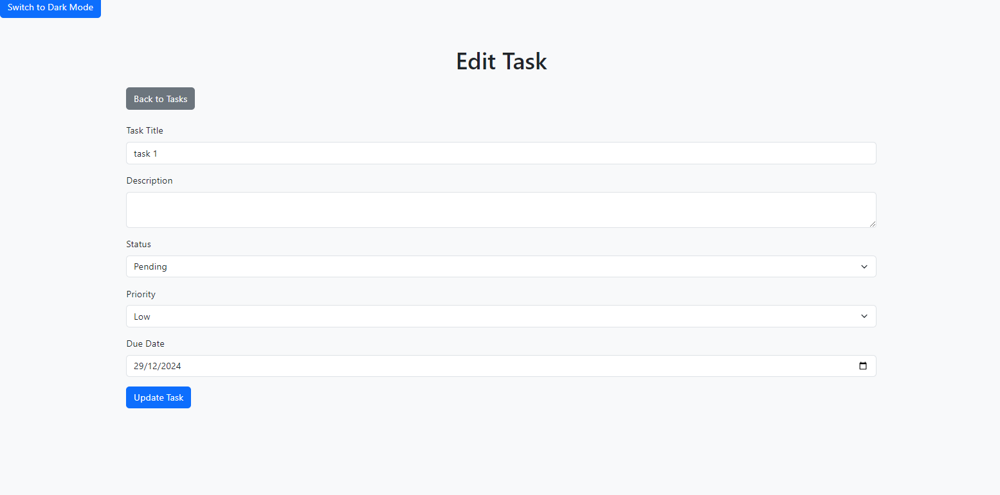
$ CATEGORIES :
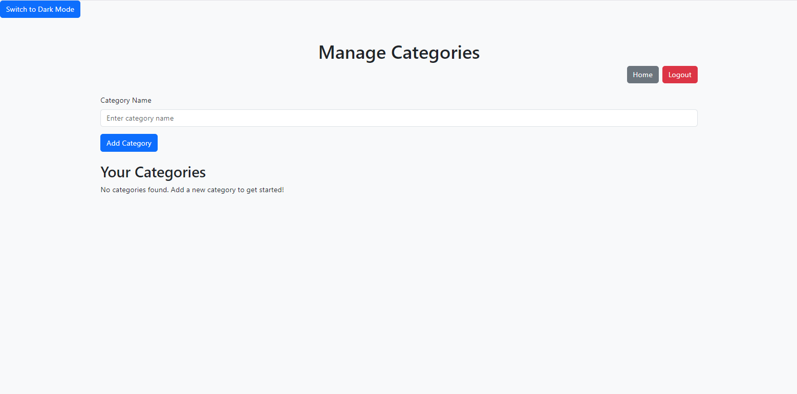
$ DARK THEME
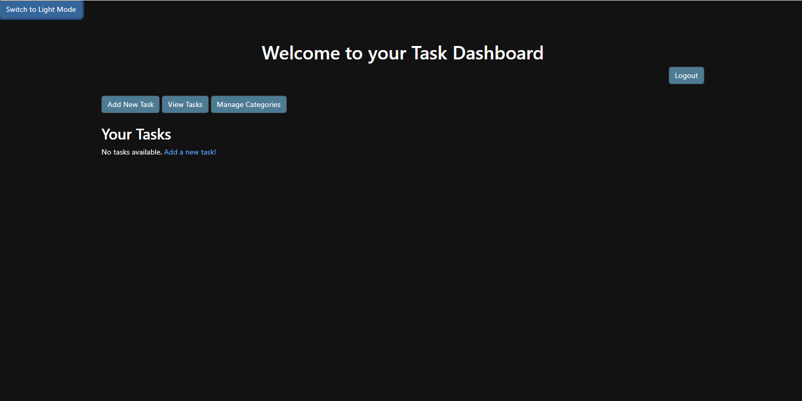

## 🔒 Security Features

- Password hashing using SHA1
- Input sanitization
- Session management
- SQL injection prevention using PDO prepared statements
- Access control for user panel

## 🗂️ Project Structure

```
.
├── .scannerwork         # Scanner-related configurations (e.g., for SonarQube)
├── config               # Configuration files for the project
├── fpdf                 # FPDF library for generating PDFs
├── .github
│   └── workflows        # CI/CD workflows (GitHub Actions)
├── public               # Publicly accessible files (e.g., index.php)
├── sql                  # SQL files for database setup and migrations
├── tests                # PHPUnit test cases
├── vendor               # Dependencies managed by Composer
├── .gitignore           # Git ignore rules
├── composer.json        # Composer dependencies definition
├── composer.lock        # Composer dependency lock file
├── phpunit.xml          # PHPUnit configuration
└── README.md            # Project documentation (this file)


```

## 💡 Key Features Explained

### User Management

* Secure registration and login system.
* Theme management.

### Task Management

* Create, update, and delete tasks.
* Assign tasks to specific users or team members.
* Set due dates and priorities for tasks.
* Track the status of tasks (e.g., pending, in progress, completed).

### Reporting System
* Generate PDF reports for task summaries using the FPDF library.
* View and download task progress reports.
* Filter tasks by status, user, or priority.

## 🤝 Contributing

Contributions are welcome! Please feel free to submit a Pull Request.

## 👨‍💻 Author

El Atmani Nisrine | Achraf Ghazal | Malki Mohamed

## Jira Projet 
[Gestion des taches projet: ]( https://nnisrine845.atlassian.net/jira/software/projects/GESTION/list )

